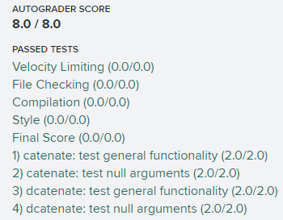
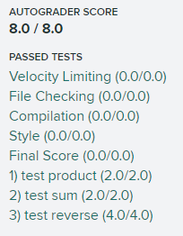
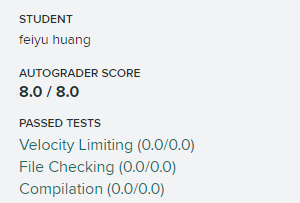
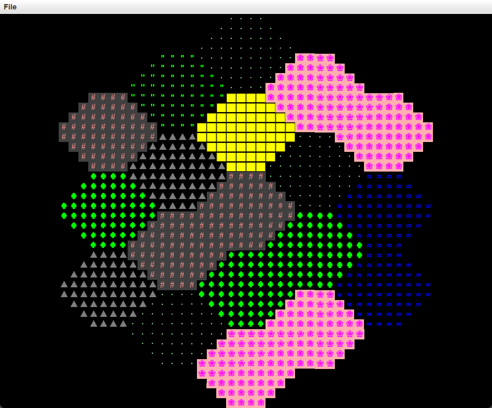
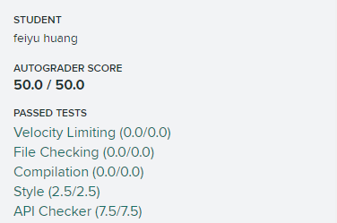
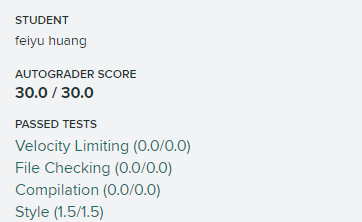
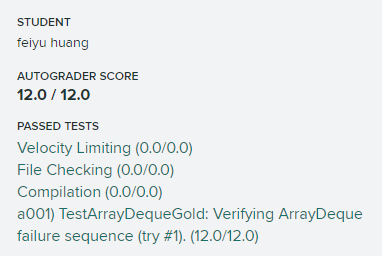

# CS61B

> [Learning-Space/Data-Structures](https://github.com/huang-feiyu/Learning-Space/tree/master/Data-Structures) 本课程仅做 lab 与 proj，而不作理论部分学习。

* [sp18](https://sp18.datastructur.es/index.html)
* [Gradescope](https://gradescope.com): MNXYKX

## Implementation

* hw
    * hw0
* lab
    * [lab1](./lab1)
    * [lab2](./lab2)
    * [lab3](./lab3)
    * [lab4](./lab4)
    * [lab5](./proj2/byog/lab5)
* proj
    * [proj0](./proj0)
    * proj1: [proj1a](./proj1a), [proj1b](./proj1b), [proj1c](./proj1gold)

## Scores

### hw

### lab

* lab2

* lab3

* lab4

* lab5

### proj

* proj1a

* proj1b

* proj1c

